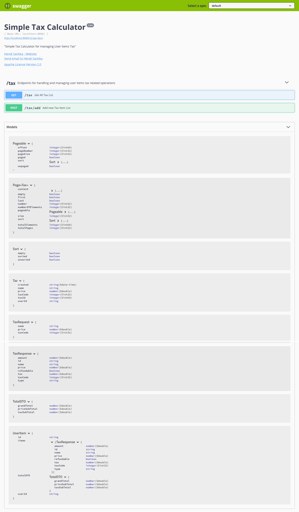
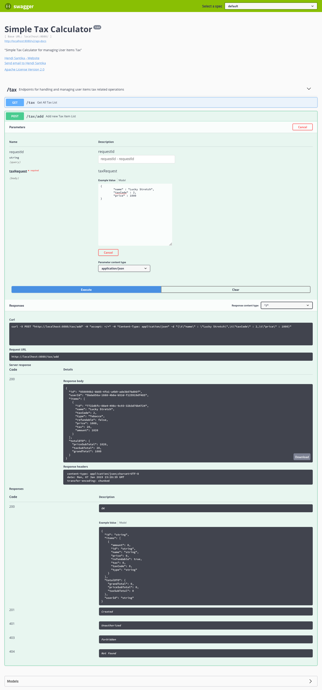
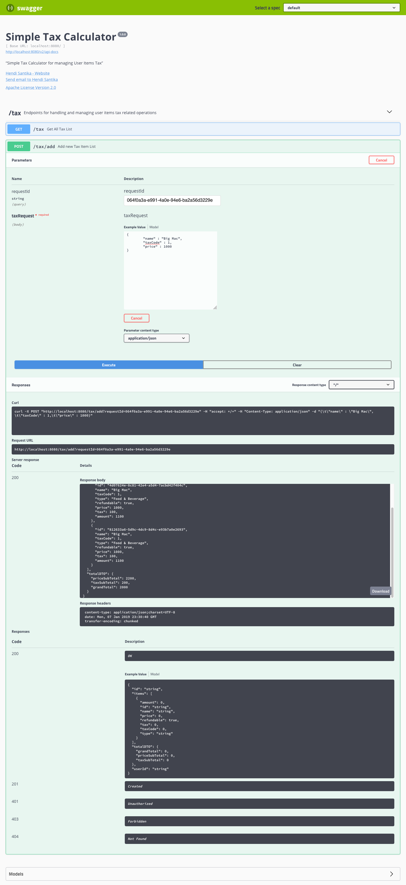
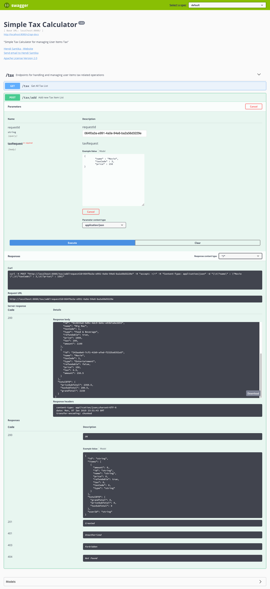

# tax-calculator

Simple Tax Calculator using Spring Boot MySQL Docker Compose

### Things to do to run without Docker (locally):

1. Clone this project by this command : `git clone https://github.com/hendisantika/tax-calculator.git`
2. Go to folder --> `cd tax-calculator`
3. If the MySQL container is not up and running, you need to run it now.
4. Change [application.properties](./src/main/resources/application.properties) based on your mysql username & password.
5. Run this project with Maven Wrapper --> `./mvnw clean spring-boot:run`
6. Open Swagger UI Dashboard on this link http://localhost:8080/swagger-ui.html and see the following screen shot:



For the first time request just add the tax json request :



For next request We need requestId to differentiate whose session user is this and whose item list is this.





Get All Tax List


### Things to do to run with Docker :

1. Building the docker image from project

   first you need to build the application. This can be done with following command

   `./mvnw clean install`

2. Once the project is buit successfully, we can build the docker image with following command.

   `docker build -f Dockerfile -t tax-calculator .`

3. Once the above process is completed, you can verify whether the docker image is built successfully with following command. It will show you a list of docker images available.

   `docker images`

4. Create a docker container for MySQL
   ```
   docker run -d \
         -p 2012:3306 \
        --name mysql-docker-container \
        -e MYSQL_ROOT_PASSWORD=root123 \
        -e MYSQL_DATABASE=taxDB \
        -e MYSQL_USER=app_user \
        -e MYSQL_PASSWORD=test123 \
           mysql:latest
   ```
5. Running the built docker image

   Now we need to run the built docker image of our spring boot application. Since this application requires to connect with MySQL server, we need to make sure that MySQL server is up and running.

   You can check the currently up and running docker containers with following command.

   `docker ps`


6. Link with MySQL Container.

   Once the mysql container is up and running, you can run your spring boot application image on container with following command.  You need to link your spring boot application with mysql container.

   `docker run -d -t --name tax-calculator --link mysql-docker-container:mysql -p 8087:8080 tax-calculator`

7. Now we can check and verify whether both containers (mysql and spring boot application containers) are up and running.

   `docker ps`

8. Verify containers are linked properly

   To verify whether the containers are linked properly, you can get into the application container (tax-calculator-container) and see the content of the /etc/hosts file.

   **login to container with bash mode**

   `docker exec -it tax-calculator bash`
   tax-calculator is the name of the container that we need to access.  bash param says that we need the bash access.

   see the content of /etc/hosts ( cat /etc/hosts )