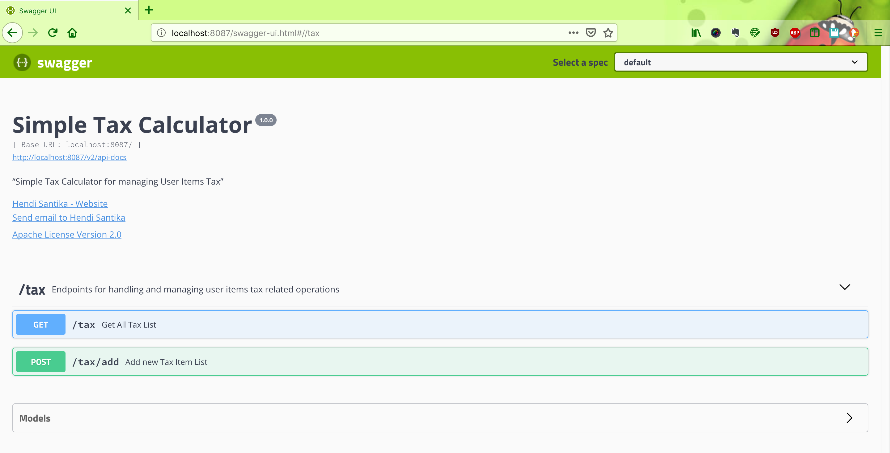
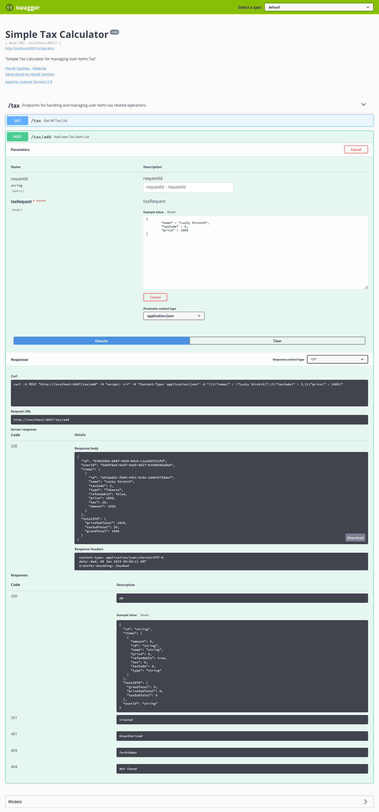
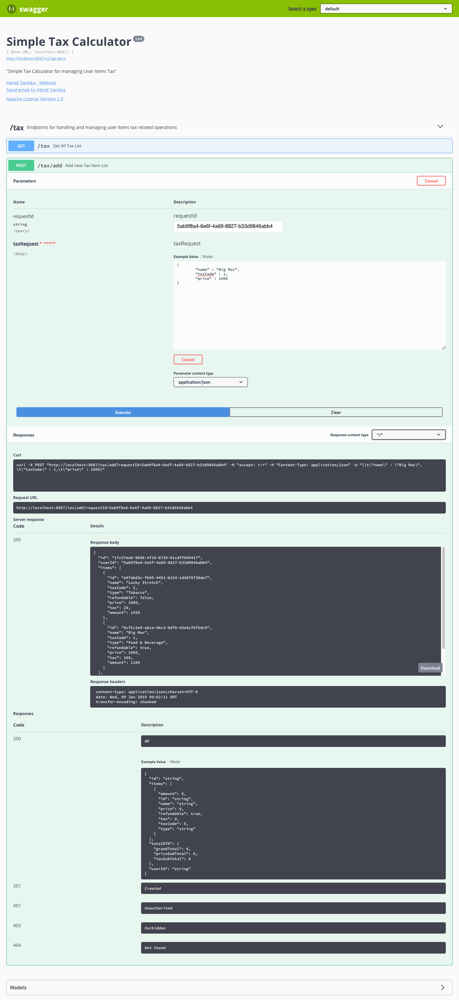
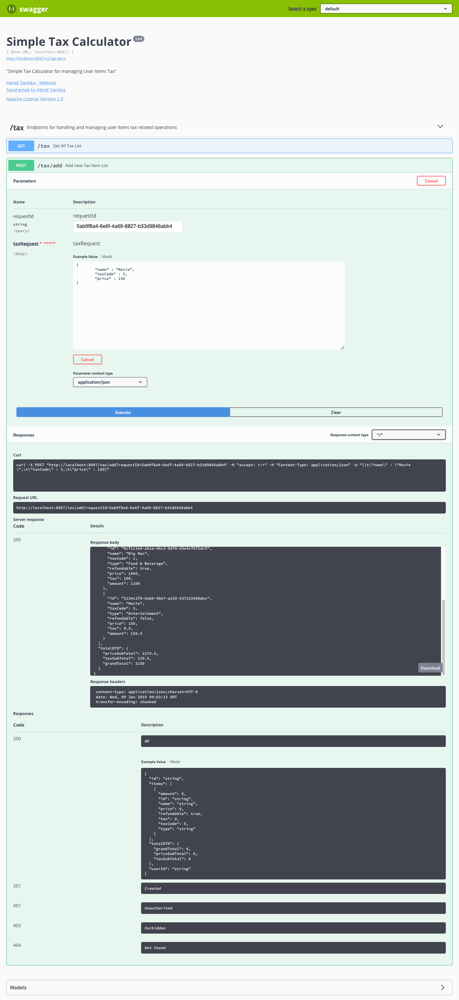
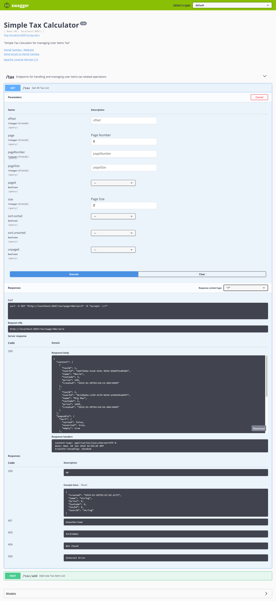

# tax-calculator

Simple Tax Calculator using Spring Boot MySQL Docker Compose

### Things to do to run without Docker (locally):

1. Clone this project by this command : `git clone https://github.com/hendisantika/tax-calculator.git`
2. Go to folder --> `cd tax-calculator`
3. If the MySQL container is not up and running, you need to run it now.
4. Change [application.properties](./src/main/resources/application.properties) based on your mysql username & password.
5. Run this project with Maven Wrapper --> `./mvnw clean spring-boot:run`
6. Open Swagger UI Dashboard on this link http://localhost:8080/swagger-ui.html and see the following screen shot:


For the first time request just add the tax json request :


For next request We need requestId to differentiate whose session user is this and whose item list is this.


Get All Tax List


### Things to do to run with Docker Compose :

1. Building the docker image from project

   first you need to build the application. This can be done with following command

   `./mvnw clean install`

2. Once the project is buit successfully, we can build the docker image with following command.

   `docker-compose up`

3. Open Swagger UI Dashboard on this link http://localhost:8087/swagger-ui.html and see the following screen shot:

   

4. For the first time request just add the tax json request :

   

5. For next request We need requestId to differentiate whose session user is this and whose item list is this.

   

   

6. Get All Tax List

   

Sample JSON Request :
```
{
	"name" : "Lucky Stretch",
	"taxCode" : 2,
	"price" : 1000
}

{
	"name" : "Big Mac",
	"taxCode" : 1,
	"price" : 1000
}

{
	"name" : "Movie",
	"taxCode" : 3,
	"price" : 150
}
```


